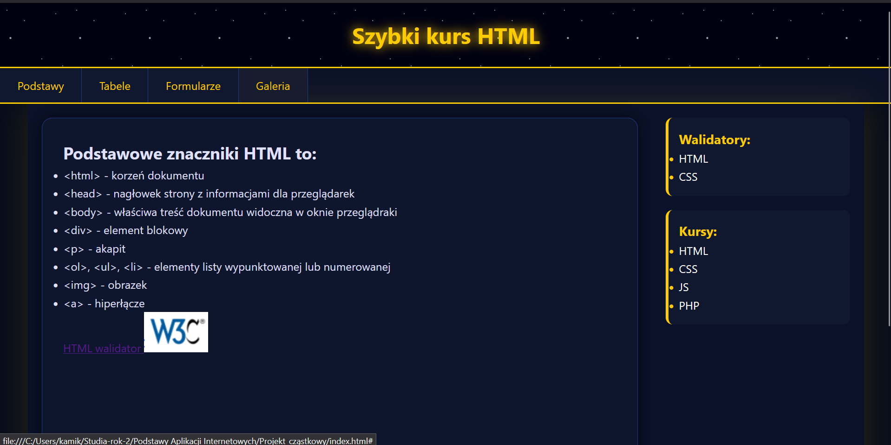
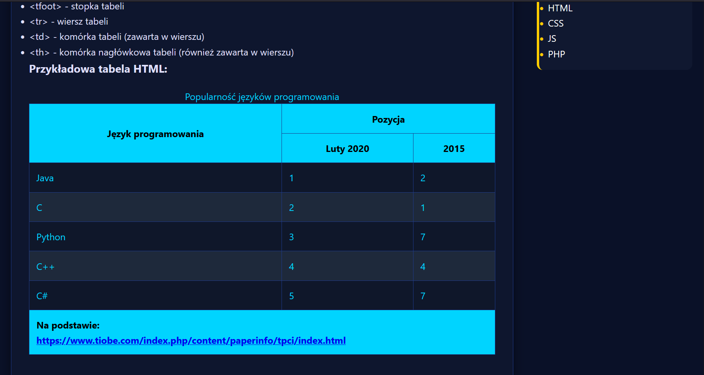
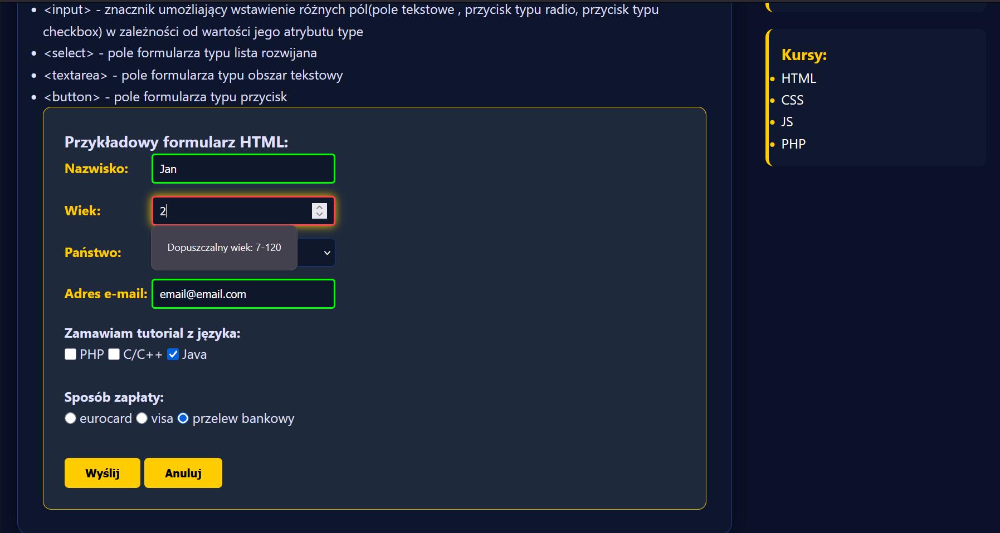
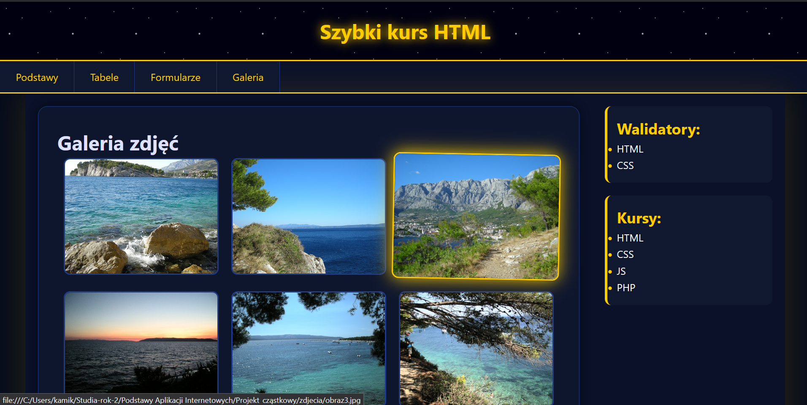

# 🛰️ Gwiezdny Interaktywny Przewodnik HTML

**Autor:** Kamil Sitarski  

---

## O projekcie i estetyce

Witryna została zaprojektowana w unikalnej estetyce **„Deep Space”**, opartej na głębokiej, ciemnej kolorystyce, która minimalizuje zmęczenie wzroku użytkownika i nadaje projektowi nowoczesny, technologiczny charakter. 

* **Kolorystyka:** Dominujący głęboki granat tła kontrastuje ze złotymi akcentami nawigacji.
* **Efekty wizualne:** Efekt gwiezdnego pyłu w nagłówku został wygenerowany w całości za pomocą zaawansowanych algorytmów CSS.
* **Interfejs:** Zastosowanie zaokrąglonych narożników (`border-radius`) oraz subtelnych poświat (`glow effect`) buduje wrażenie trójwymiarowości i głębi interfejsu.
* **Geneza:** Strona bazuje na projekcie rozwijanym podczas laboratoriów 1-3, rozbudowanym o zaawansowane mechanizmy interaktywne.
* **Live Demo:** [🚀 Uruchom projekt](https://interaktywnyprzewodnikhtml.vercel.app/)

---

## Najciekawsze funkcjonalności

1. **Dynamiczny nagłówek z efektem gwiezdnym:** Wykorzystanie nakładających się gradientów radialnych w CSS pozwala na stworzenie głębokiego, kosmicznego tła bez użycia zewnętrznych ciężkich plików graficznych, co radykalnie optymalizuje czas ładowania strony.
2. **Inteligentna walidacja formularza w czasie rzeczywistym:** Formularz sprawdza poprawność wprowadzanych danych (np. format adresu e-mail, zakres wieku) i komunikuje to wizualnie poprzez dynamiczną zmianę koloru obramowań pól za pomocą pseudoklas `:valid` i `:invalid`.
3. **Interaktywna galeria z efektem „Glow”:** Miniatury zdjęć reagują płynnie na najechanie kursorem myszy (efekt `:hover`) poprzez powiększenie i dodanie złotej poświaty.
4. **Adaptacyjny układ tabeli:** Tabela prezentująca popularność języków programowania posiada błękitną, kontrastową stylistykę oraz automatyczne naprzemienne kolorowanie wierszy, ułatwiające skanowanie wzrokiem.
5. **Pełna responsywność (RWD):** Dzięki elastycznym siatkom oraz punktom kontrolnym, cała zawartość witryny – w tym tabele, galerie i formularze – płynnie dopasowuje się do ekranów smartfonów i tabletów.
6. **Zintegrowany Menedżer Zadań i Planu (JS):** *Nowość!* System oparty na języku JavaScript integrujący harmonogram zajęć uczelnianych z prywatnym kalendarzem zadań zapisanym w `localStorage`. Lista zadań na stronie głównej automatycznie sortuje wpisy chronologicznie od najbliższego terminu do najdalszego.

---

## Zastosowane technologie i rozwiązania

* **HTML5 Semantics:** Pełne wykorzystanie strukturalnych znaczników semantycznych (`<header>`, `<nav>`, `<main>`, `<aside>`, `<footer>`) gwarantujących poprawną architekturę informacji oraz SEO.
* **CSS3 Flexbox & Grid:** Całkowite odejście od przestarzałego pozycjonowania float na rzecz nowoczesnych, elastycznych kontenerów w układzie kolumnowym oraz siatki galerii.
* **CSS3 Selectors & Visual Effects:** Wykorzystanie gradientów radialnych, cieniowania (`box-shadow`), płynnych przejść (`transition`) oraz zaawansowanych selektorów strukturalnych do automatycznego formatowania tabel bez modyfikacji kodu HTML.
* **JavaScript (ES6):** Obsługa dynamicznej manipulacji drzewem DOM, asynchronicznego pobierania planu (Promises/Fetch API) oraz zarządzania pamięcią przeglądarki (`localStorage`).

---

## Struktura widoków i dokumentacja zdjęciowa

Wszystkie pliki graficzne oraz zrzuty ekranu dokumentujące działanie systemu znajdują się w strukturze projektu.

### Widoki podstron aplikacji:
* **Rys. 1.1** – Główny panel pulpitu i nawigacji (`index.html`) 
* **Rys. 1.2** – Interaktywny i adaptacyjny układ tabeli (`tabele.html`)
* **Rys. 1.3** – Formularz z walidacją danych w czasie rzeczywistym (`formularze.html`)
* **Rys. 1.4** – Multimedialna galeria z efektami rozświetlenia (`galeria.html`)

---

## Walidacja i Kontrola Jakości (W3C)

Kod źródłowy projektu został poddany testom poprawności składniowej za pomocą oficjalnych walidatorów W3C. 

Pozytywny wynik testów strukturalnych HTML5 oraz zgodności z CSS3 gwarantuje, że strona internetowa wyświetla się w sposób w pełni przewidywalny, stabilny i spójny na wszystkich nowoczesnych silnikach przeglądarek internetowych (Chromium, Gecko, WebKit).
