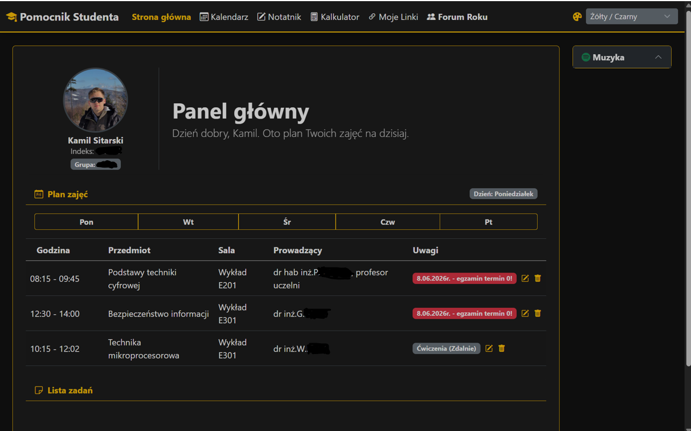
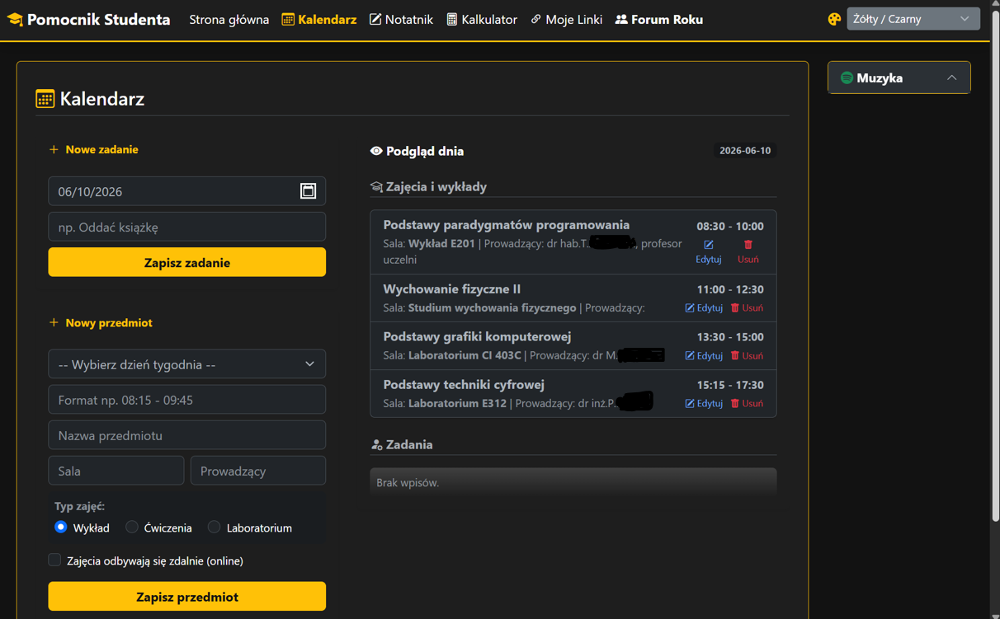
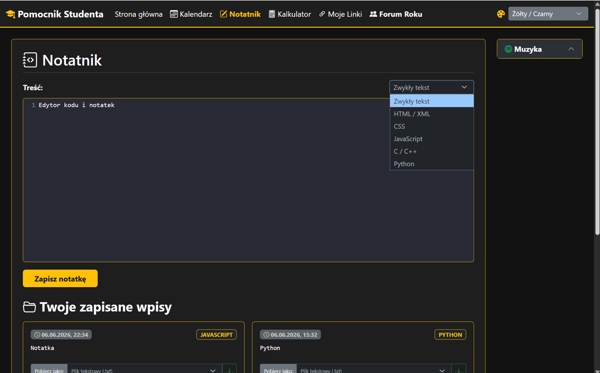
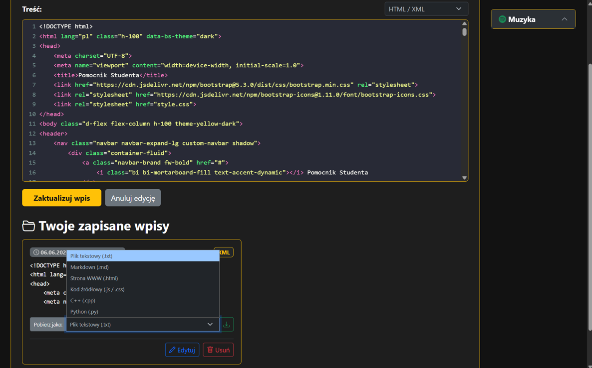
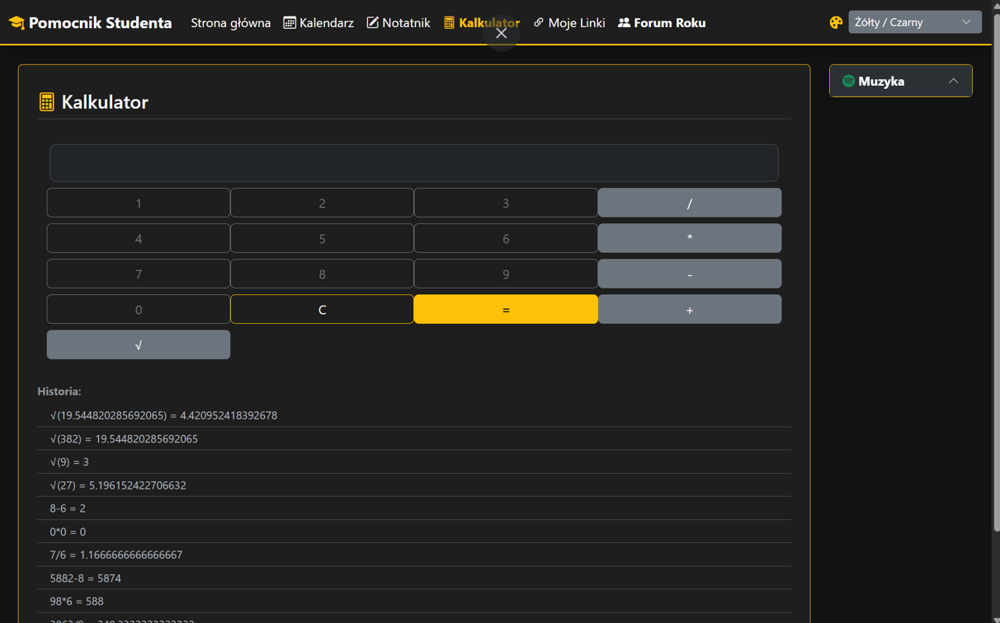
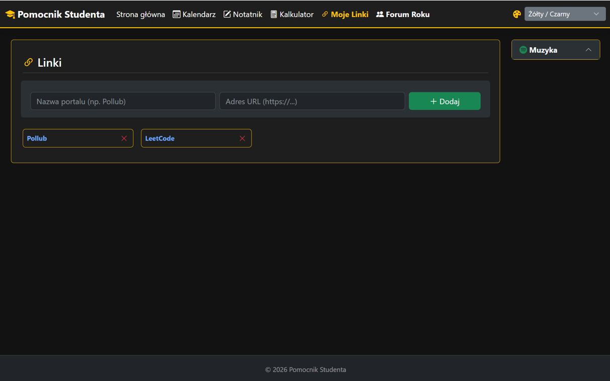
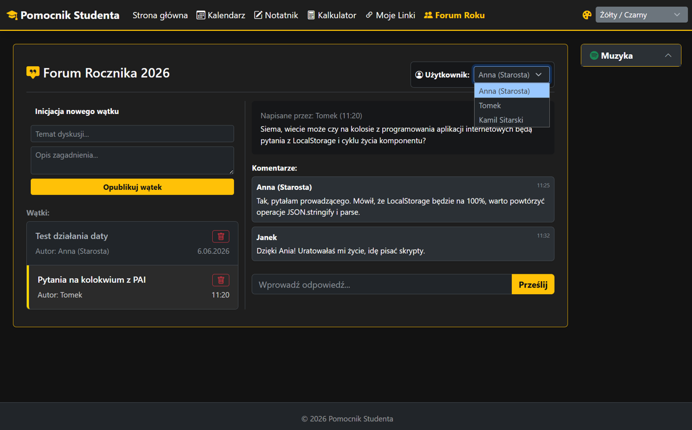
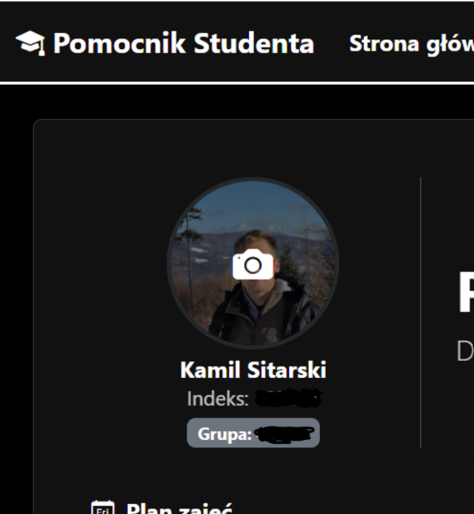
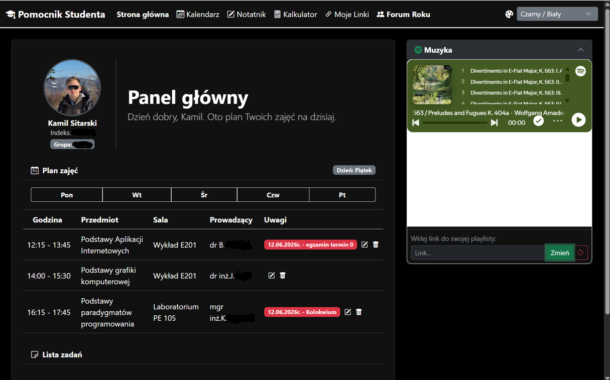
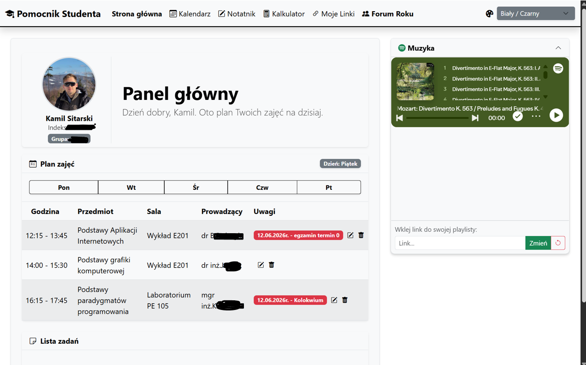

# Pomocnik Studenta — Kompleksowy Asystent Akademicki & SPA Organizer

Zaawansowana aplikacja webowa typu **SPA (Single Page Application)** stanowiąca kompletne środowisko do zarządzania procesami edukacyjnymi, czasem oraz komunikacją. Projekt demonstruje użycie czystego JavaScriptu (Vanilla JS ES6+) do zarządzania stanem, asynchronicznego pobierania danych oraz dynamicznej personalizacji interfejsu (UX/UI) przy użyciu frameworka Bootstrap 5.

**Autor:** Kamil Sitarski 

**Uruchom projekt:** [🚀 Zobacz Live Demo](https://pulpitstudenta.vercel.app/)

**⚠️ Uwaga dotycząca uruchamiania:**
Aplikacja korzysta z asynchronicznego pobierania danych (Fetch API) oraz Web Storage API. Z tego względu, w przypadku pobrania plików na dysk lokalny, uruchomienie aplikacji bezpośrednio poprzez dwukrotne kliknięcie w index.html (protokół file://) może zablokować niektóre funkcjonalności ze względów bezpieczeństwa przeglądarki (blokada CORS).

**Zalecam:**

    Korzystanie z wersji Live Demo dostępnej w tym repozytorium (działa w pełni bez żadnej konfiguracji).
    Uruchamianie plików lokalnie wyłącznie przez wtyczkę Live Server w VS Code lub WebStorm, co symuluje środowisko serwera (protokół http://).
---

## Kluczowe Moduły i Funkcjonalności

### 📅 Inteligentny Menadżer Harmonogramu & Kalendarza
Serce aplikacji stanowi asynchroniczny moduł kalendarza integrujący dwa kluczowe obszary zarządzania czasem:
* **Konfiguracja planu zajęć:** Pełna implementacja operacji CRUD (Create, Read, Update, Delete) na obiektach danych. Użytkownik może dynamicznie definiować przedmioty, sale, typy zajęć (wykład, ćwiczenia, laboratorium) oraz przypisywać prowadzących.
* **Chronologiczny Planner Zadań:** Moduł, który automatycznie agreguje, filtruje i sortuje zadania od najbliższego terminu. System posiada wbudowaną logikę powiadomień wizualnych (statusy egzaminów i kolokwiów).
* **Asynchroniczność & Stan:** Dane domyślne pobierane są bez przeładowania strony z zewnętrznych struktur JSON (**Fetch API / Promises**), a wszelkie modyfikacje użytkownika są natychmiastowo serializowane i utrwalane w **Web Storage API (localStorage)**.

### 📝 Edytor Kodu & System Notatek
Zaprojektowany z myślą o studentach kierunków technicznych, moduł łączy klasyczny edytor tekstu z funkcjami deweloperskimi:
* **Wsparcie dla programistów:** Symulacja kolorowania składni dla wielu popularnych środowisk (HTML, CSS, JS, C++, Python).
* **Ekspozycja danych:** Wbudowany mechanizm eksportu plików umożliwiający pobranie lokalnych notatek do zewnętrznych formatów tekstowych (**TXT, JSON**) bezpośrednio na dysk komputera.

### 💬 Symulator Platformy Społecznościowej (Forum Roku)
Interaktywny moduł komunikacyjny działający w czasie rzeczywistym bez backendu relacyjnego:
* **Logika wieloużytkownikowa:** System implementuje architekturę symulacji sesji, umożliwiając przełączanie aktywnego profilu użytkownika w celu testowania interakcji społecznościowych.
* **Dynamiczne renderowanie:** Inicjowanie nowych wątków, przeglądanie tematów i dodawanie komentarzy odbywa się poprzez bezpośrednią manipulację drzewem DOM z pełną persistencją danych w pamięci lokalnej.

### 🎨 Personalizacja Środowiska (Dostępność i Multimedia)
Aplikacja kładzie ogromny nacisk na inkluzywność, ergonomię pracy i User Experience:
* **System Motywów (CSS Variables):** Dynamiczny przełącznik trybów kolorystycznych: jasny, ciemny oraz specjalny tryb wysokiego kontrastu (Żółty/Czarny) spełniający podstawowe wytyczne dostępności cyfrowej.
* **Integracja z Spotify API (Embed Player):** Osadzony odtwarzacz multimedialny wspierający dynamiczną podmianę identyfikatorów playlist. Użytkownik może wkleić własny link do streamu bezpośrednio w UI aplikacji, personalizując swoje tło dźwiękowe do nauki.

---

## Wykorzystane technologię

| Warstwa | Technologia / Rozwiązanie | Zastosowanie i rola w projekcie |
| :--- | :--- | :--- |
| **Frontend Core** | HTML5 (Semantic), CSS3, JavaScript (ES6+) | Architektura aplikacji, logika biznesowa, czysty kod zorientowany na zdarzenia |
| **UI Framework** | Bootstrap 5 | Responsywny system siatkowy (Grid), gotowe komponenty interfejsu, skrócenie czasu devu |
| **State Management**| Web Storage API (`localStorage`) | Trwałe przechowywanie danych profilu, wpisów na forum, notatek i planu zajęć |
| **Data Flow** | Fetch API / JSON / Promises | Asynchroniczne zasilanie aplikacji danymi strukturalnymi z zewnętrznych źródeł |
| **Dostępność (Accessibility)** | CSS Custom Properties | Dynamiczne zarządzanie motywami kolorystycznymi w czasie rzeczywistym |

---

## Instrukcja Wdrożenia Lokalnego (Setup)

W celu uruchomienia środowiska deweloperskiego na lokalnej maszynie, wykonaj poniższą sekwencję kroków:

<Sequence>
{/* Reason: Procedura uruchomienia projektu wymaga ścisłej kolejności działań. Niepoprawne uruchomienie (np. otwarcie bezpośrednio pliku HTML z dysku zamiast przez serwer) zablokuje działanie Fetch API i localStorage ze względu na politykę CORS. */}
  <Step title="Pobranie repozytorium" subtitle="Krok 1">
    Wypakuj zawartość archiwum z projektem lub sklonuj repozytorium do wybranego folderu na dysku.
  </Step>
  <Step title="Konfiguracja w IDE" subtitle="Krok 2">
    Otwórz główny folder projektu w nowoczesnym środowisku programistycznym (rekomendowany **WebStorm** lub **Visual Studio Code**).
  </Step>
  <Step title="Inicjalizacja serwera lokalnego" subtitle="Krok 3">
    Uruchom aplikację za pomocą wbudowanego serwera deweloperskiego. W VS Code użyj wtyczki **Live Server**, w WebStorm proces ten uruchamia się automatycznie przy kliknięciu podglądu pliku `index.html`.
  </Step>
  <Step title="Dostęp produkcyjny" subtitle="Krok 4">
    Przeglądarka internetowa automatycznie zainicjuje sesję pod lokalnym adresem sieciowym (np. `http://localhost:63342` lub `http://127.0.0.1:5500`).
  </Step>
</Sequence>

---

## Prezentacja Interfejsu i Dokumentacja Wizualna (UI Showroom)

### Panel Główny (Dashboard)
Centralna sekcja aplikacji w trybie wysokiego kontrastu (Dostępność / Accessibility Mode). Widoczny interaktywny plan oraz system powiadomień.

### Kalendarz i Planner Zadań
Zaawansowany panel konfiguracji harmonogramu z dynamicznym podglądem wybranego dnia.

### Notatnik z Edytorem Kodu
Moduł tworzenia dokumentacji z selektorem rozszerzeń plików i opcją natywnego zapisu do pamięci lokalnej.

### Wbudowane Narzędzia Wspomagające (Kalkulator)
Kompaktowy komponent obliczeniowy z pełną rejestracją historii operacji matematycznych.

### Personalizacja Zasobów (Centrum Linków)
Dynamiczna baza odnośników edukacyjnych zarządzana przez użytkownika na poziomie operacji na tablicach JS.

### Interaktywne Forum Społecznościowe
Moduł symulacji wieloużytkownikowej wymiany informacji z dynamicznym wstrzykiwaniem danych do drzewa DOM.

### Profil Użytkownika & Zarządzanie Motywami
System zmiany avatara połączony z kontrolerem zmiennych CSS odpowiedzialnych za tryby wizualne.

### Multimedialny Moduł Spotify (Integracja API)
Prezentacja osadzonego odtwarzacza w alternatywnych trybach kolorystycznych (Light/Dark Mode).

---

## Standardy Jakościowe i Walidacja

Projekt został zbudowany zgodnie z paradygmatem **Clean Code** i przeszedł pomyślnie testy zgodności strukturalnej:
* **W3C HTML5 Validator:** Pełna zgodność semantyczna kodu, brak błędów strukturalnych.
* **W3C CSS Validator:** Prawidłowa struktura arkuszy stylów oraz poprawna deklaracja zmiennych CSS.
* **Cross-Browser Compatibility:** Kod JavaScript oraz style Bootstrap 5 zapewniają identyczne renderowanie i optymalną wydajność na silnikach Blink (Chrome), Gecko (Firefox) oraz WebKit (Safari).
