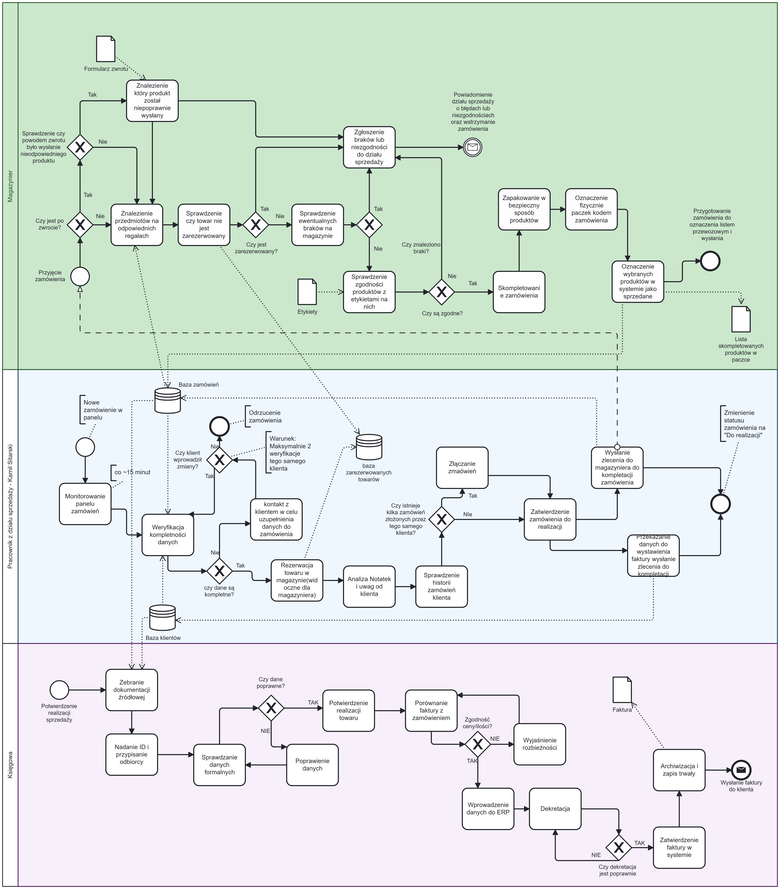
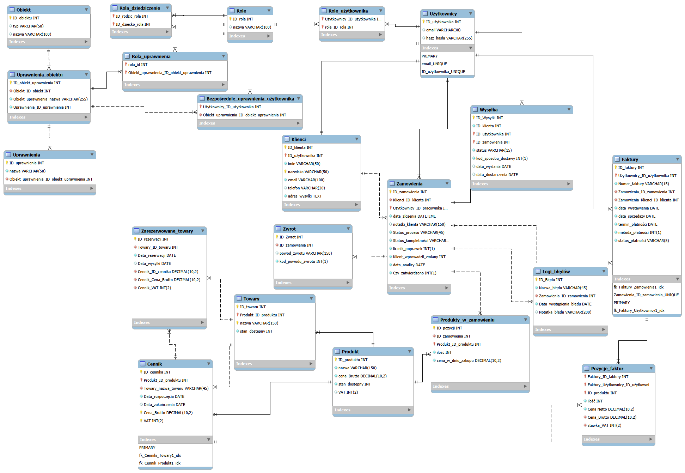
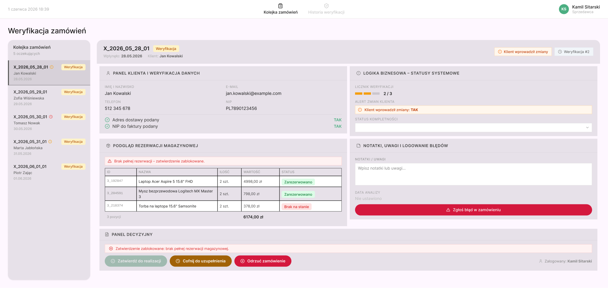

System Sklepu Internetowego (PIO)
Opis Projektu

Projekt systemu informatycznego dla sklepu internetowego, zaprojektowany w celu optymalizacji procesów sprzedażowych, magazynowych oraz księgowych. System automatyzuje przepływ informacji między działami, minimalizując ryzyko błędów ręcznych oraz zwiększając efektywność obsługi zamówień.  
Kluczowe Funkcjonalności

    Moduł Sprzedaży: Automatyzacja weryfikacji danych klienta, rezerwacja towaru oraz blokowanie edycji zamówień po 2. weryfikacji w celu zapewnienia spójności danych.  

    Moduł Magazynowy: Wsparcie dla terminali mobilnych, precyzyjne lokalizowanie produktów na magazynie oraz automatyczne generowanie raportów rozbieżności.  

    Moduł Księgowy: Automatyczne generowanie faktur VAT, monitoring statusów płatności oraz eksport danych do zewnętrznych systemów finansowo-księgowych (XML).  

Technologie i Narzędzia

    Analiza Procesów: Notacja BPMN.  

    Modelowanie Danych: Diagramy DFD (Poziom 1 i 2), diagramy ERD (baza danych).  

    Interfejs: Projektowanie mockupów dla ról: Sprzedawca, Magazynier, Księgowa.  

    Integracja: Formaty wymiany danych XML.  

Struktura Dokumentacji

Projekt obejmuje pełną specyfikację systemową:

    Analiza Biznesowa: Historyjki użytkowników oraz diagramy procesów BPMN.  

    Architektura Danych: Diagramy DFD dla ewidencji klientów, pracowników, towarów oraz sprzedaży i zarządzania.  

    Baza Danych: Relacyjny model bazy danych (ERD) obsługujący zamówienia, faktury, stany magazynowe i uprawnienia użytkowników.  

    Prototypy (Mockupy): Interfejsy użytkownika dla kluczowych ról w systemie.  

### Analiza Procesów (BPMN)
Poniższy diagram przedstawia główny proces biznesowy sklepu internetowego:

### Model Bazy Danych
Projekt opiera się na relacyjnej bazie danych, zaprojektowanej z myślą o spójności danych sprzedażowych i magazynowych.

#### Dokumentacja techniczna bazy danych:
* [Pobierz pełny skrypt SQL (schema.sql)](./database/schema.sql) – definicja struktury tabel, kluczy głównych oraz relacji.

### Projekt interfejsu (Mockup):

Główny panel operacyjny sprzedawcy zorientowany na optymalizację procesu weryfikacji zamówień. Projekt realizuje zasadę *Zarządzania Kontekstem* – integruje dane klienta, stany magazynowe oraz panel akcji decyzyjnych w jednym, ergonomicznym widoku, bezpośrednio wspierając procesy biznesowe zdefiniowane w dokumentacji.

## Pełna dokumentacja
* [📄 Pobierz pełną dokumentację projektu (PDF)](./docs/Sklep-Internetowy-PIO-Projekt.pdf)

Projekt zrealizowany w ramach przedmiotu Podstawy Inżynierii Oprogramowania w zespole 3-osobowym.  

    Główny architekt i implementacja: Kamil Sitarski.
