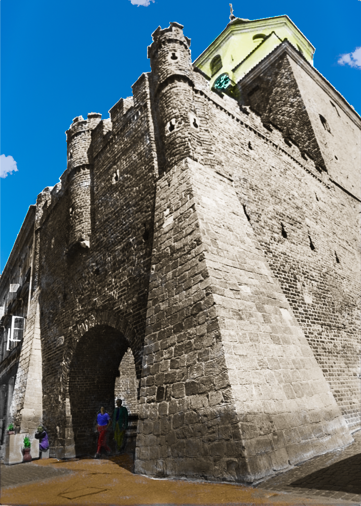
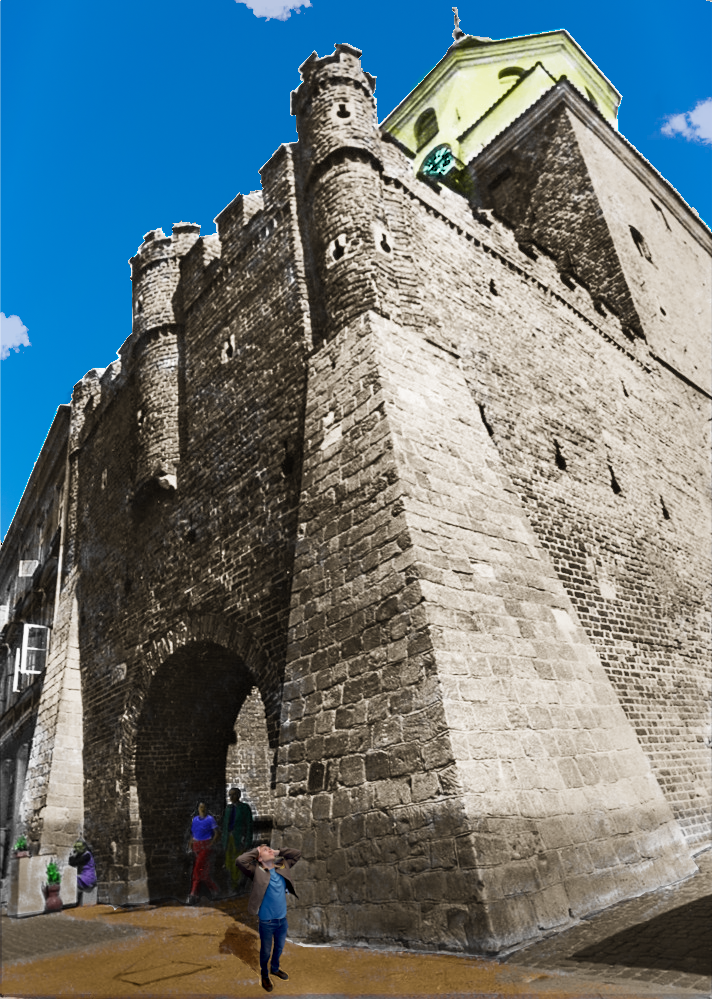

# Projekt: Architektura Obrazu – Rekonstrukcja Bramy Krakowskiej

**Autor:** Kamil Sitarski  

---

## 🎯 Cel Projektu
Projekt stanowi studium zaawansowanej edycji grafiki rastrowej, przeprowadzone w trzech kluczowych fazach. Celem było nie tylko techniczne oczyszczenie materiału źródłowego, ale całkowita transmutacja obrazu – od naprawy artefaktów, przez autorską kolorystykę, aż po fotorealistyczny montaż postaci wewnątrz wykreowanej rzeczywistości.

## 🛠 Stos Technologiczny
*   **Oprogramowanie:** Gimp
*   **Kluczowe techniki:** Edycja nieliniowa, segmentacja obiektowa (warstwowa), kluczowanie kanałem alfa, korekcja perspektywy oraz optymalizacja dynamiki tonalnej.

---

## 🚀 Przebieg Prac

### Etap 1: Naprawa i Korekta Techniczna
Fundament projektu skupiony na czystości obrazu i poprawności geometrycznej.
*   **Retusz:** Usunięcie skaz oraz niepożądanych elementów (napis „LM”) przy użyciu narzędzia „Łatka”.
*   **Geometria:** Korekta perspektywy obiektu w celu uzyskania poprawnej kompozycji.
*   **Dynamika:** Optymalizacja krzywych tonalnych (pogłębienie czerni przy zachowaniu detali świateł) oraz selektywne wyostrzanie architektury.

### Etap 2: Koloryzacja i Kompozycja Środowiskowa
Przekształcenie monochromatycznego obrazu w pełną barw, suwerenną wizję.
*   **Separacja:** Izolacja poszczególnych elementów (architektura, bruk, postacie) przy użyciu narzędzi „Lasso” oraz „Nożyce”.
*   **Koloryzacja:** Zastosowanie dedykowanych warstw i precyzyjne malowanie barw za pomocą „Pędzla”.
*   **Atmosfera:** Wymiana nieba i dodanie chmur z wykorzystaniem techniki „Kolor na alfę”, co nadało scenie dynamizmu.

### Etap 3: Montaż i Integracja Postaci
Finałowa faza, w której autor zostaje osadzony wewnątrz wykreowanego świata.
*   **Integracja:** Precyzyjne wycięcie sylwetki za pomocą „Nożyc” oraz jej odpowiednie przeskalowanie.
*   **Fotorealizm:** Korekta jasności oraz ręczne malowanie cienia na oddzielnej warstwie w celu „zakotwiczenia” postaci w perspektywie.
*   **Finalizacja:** Spójne połączenie wszystkich warstw atmosferycznych w jednolitą, domkniętą kompozycję.

---

## 🖼 Galeria Efektów

| Faza projektu | Podgląd |
| :--- | :--- |
| **Stan oryginalny** |  |
| **Po Etapie 1** |  |
| **Po Etapie 2** |  |
| **Po Etapie 3** |  |

---
