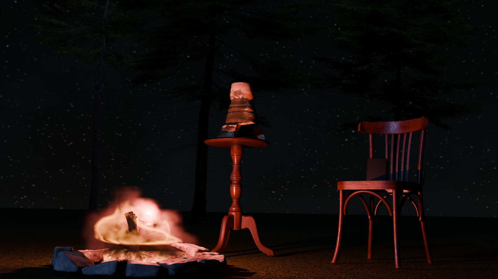

# Projekt: Architektura Nocy – Kreacja, Shading i Animacja (Blender)

**Autor:** Kamil Sitarski  

---

## Cel Projektu
Projekt stanowi studium syntezy środowiska 3D, zaawansowanego shading'u PBR oraz reżyserii dynamicznej sekwencji filmowej. Celem było nie tylko techniczne zbudowanie sceny, ale wykreowanie gęstego, mrocznego klimatu nocy, w którym surowy obiekt archeologiczny (świecznik) staje się centrum narracji, przerwanej gwałtownym akcentem animacyjnym. Całość została poddana rygorystycznej optymalizacji pod kątem wydajności silnika Cycles.

## 🛠 Stos Technologiczny
*   **Silnik graficzny:** Blender 3D (Render Engine: Cycles)
*   **PBR Workflow:** Mapowanie struktur wejściowych (Normal, Specular, Ambient Occlusion).
*   **Shading:** Zaawansowana edycja węzłów (Shader Nodes) i operacje na kanałach barwnych.
*   **Animacja:** Reżyseria klatek kluczowych (Keyframing), transformacje fizyczne (rotacja i translacja).
*   **Optymalizacja:** Zarządzanie pamięcią VRAM, manipulacja frustum kamery oraz redukcja szumu światła.

---

## Przebieg Pracy

### Etap 1: Budowa Środowiska (World Building)
Ujarzmienie pustej przestrzeni trójwymiarowej i narzucenie jej surowego, nocnego klimatu.
*   **Scenografia:** Kompozycja elementów otoczenia (stół, krzesło, książka, drzewa) wokół głównego artefaktu.
*   **Iluminacja:** Kontrast chłodnego, księżycowego światła kierunkowego (Sun Light) z dzikim, ciepłym rozbłyskiem punktowym umieszczonym nad modelem ogniska.
*   **Horyzont:** Zredukowanie jasności tła świata i implementacja nocnej sfery nieba.

### Etap 2: Anatomia Materiału (Zaawansowany Shading PBR)
Wydobycie organicznej faktury i mikro-szczegółów ze statycznego, surowego skanu.
*   **Generowanie danych:** Matematyczna ekstrakcja map `Normal`, `Specular` i `AO` na bazie tekstury koloru.
*   **Shader Graph:** 
    *   Wstrzyknięcie mapy normalnych w przestrzeni `Non-Color` dla uzyskania fizycznych wypukłości.
    *   Mnożenie (Multiply) tekstury bazowej przez `Ambient Occlusion` w celu pogłębienia cieni kontaktowych.
    *   Inwersja mapy `Specular` za pomocą węzła Invert w celu precyzyjnego wysterowania połysku (`Roughness`).

### Etap 3: Dynamika, Destrukcja i Optymalizacja
Wprowadzenie akcji do zamrożonego świata przy jednoczesnym bezwzględnym cięciu kosztów renderowania.
*   **Chaos kontrolowany:** Zaprogramowanie realistycznej trajektorii lotu i uderzenia siekiery w krzesło przy użyciu klatek kluczowych (Keyframes).
*   **Cięcie zasobów:** Usunięcie proceduralnego nieba na rzecz emisyjnej czerni – drastyczne skrócenie czasu kalkulacji odbić światła dla 50 klatek.
*   **Geometria:** Agresywne przycięcie siatki podłoża wyłącznie do obszaru widzenia (frustum) kamery, odciążające pamięć karty graficznej.

---

## 🖼 Galeria Efektów

| Faza projektu | Opis procesu | Podgląd |
| :--- | :--- | :--- |
| **Etap 1** | Surowa kompozycja, budowa klimatu i oświetlenia |  |
| **Etap 2** | Detale PBR (Świecznik po rekonstrukcji struktur) |  |
| **Etap 3** | Finałowa sekwencja animacji (Uderzenie siekiery) |  |

---
